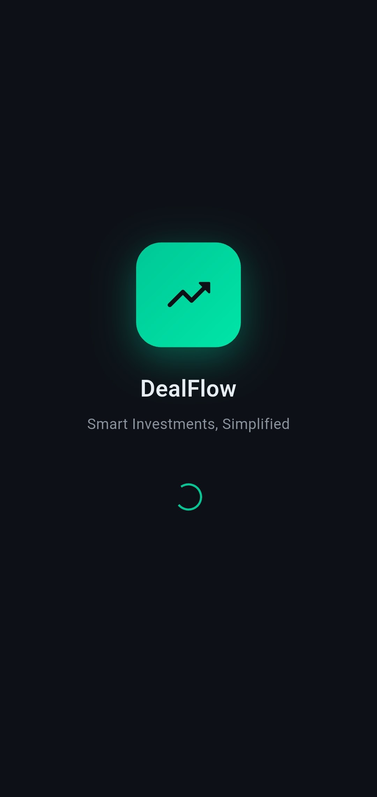
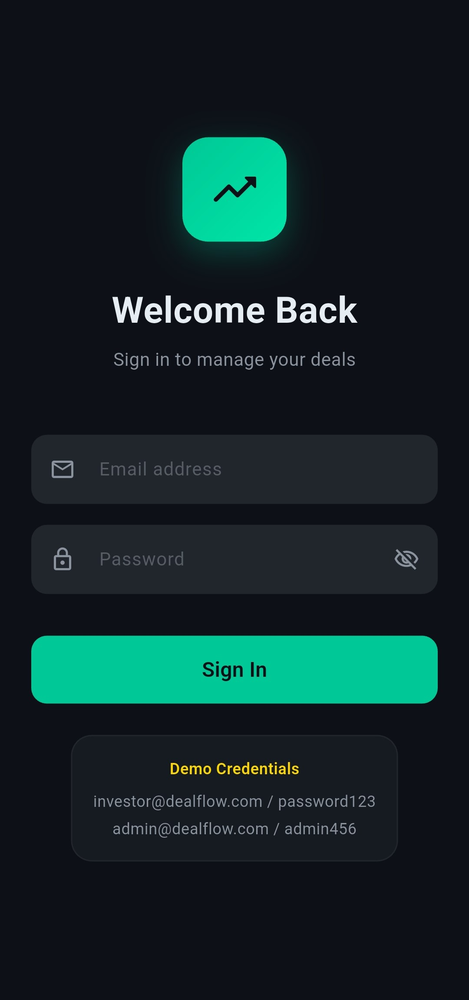
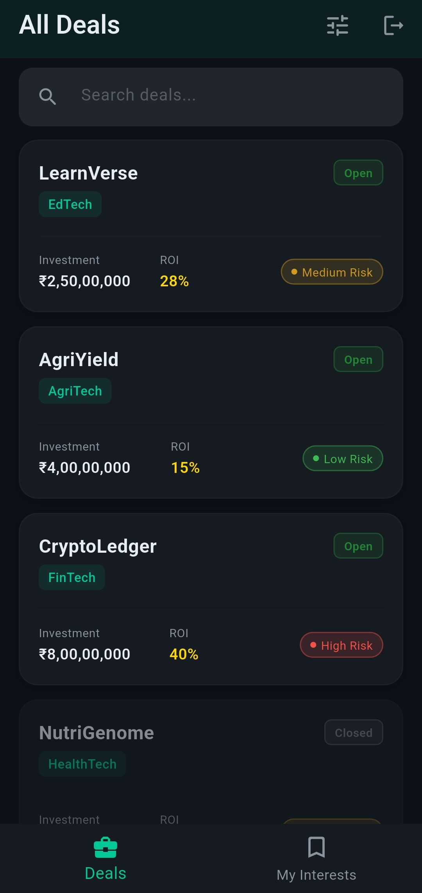
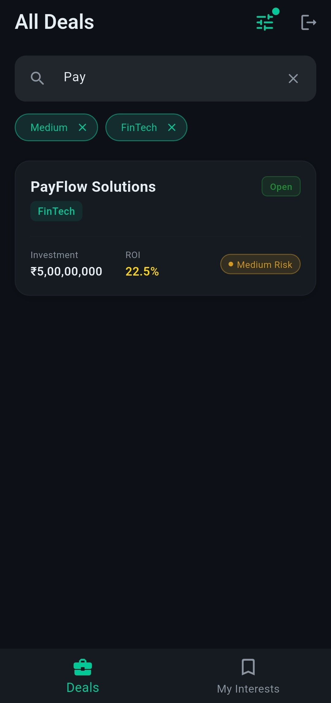
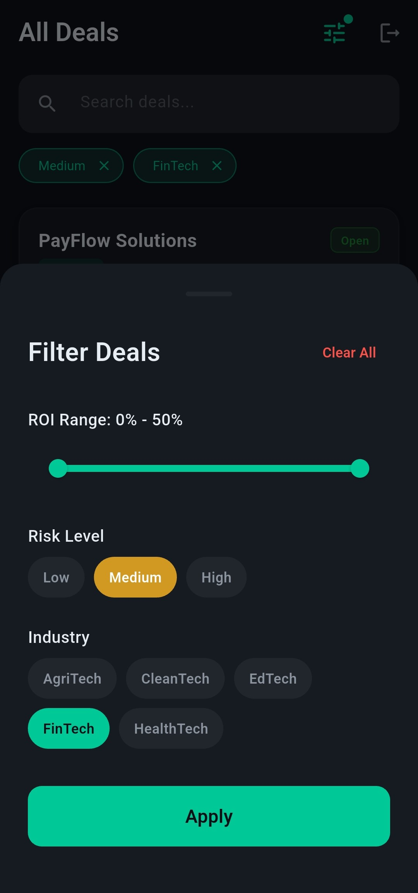
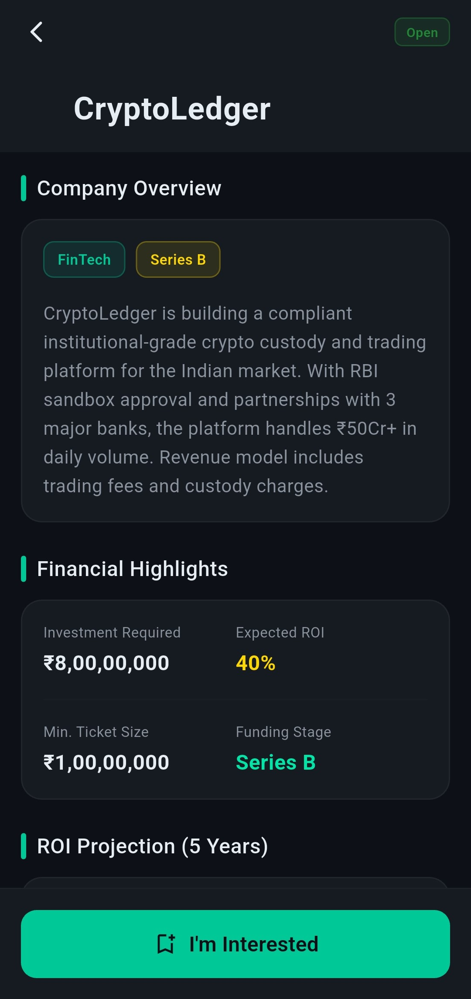
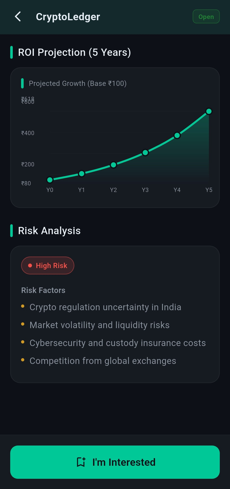
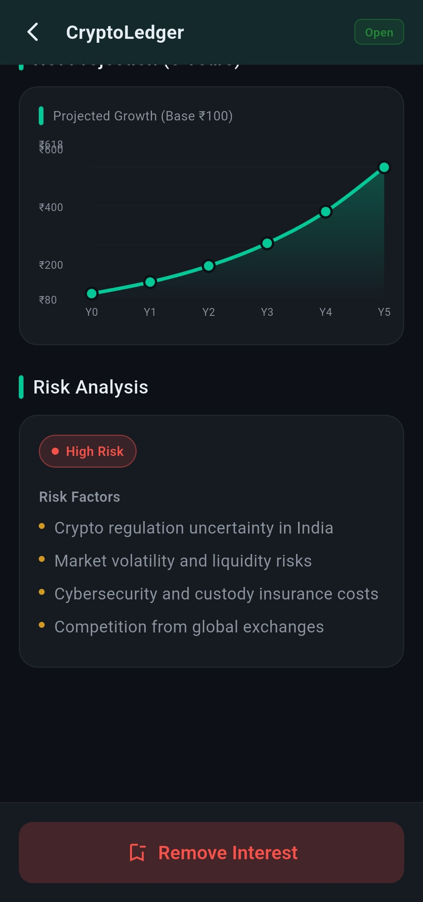
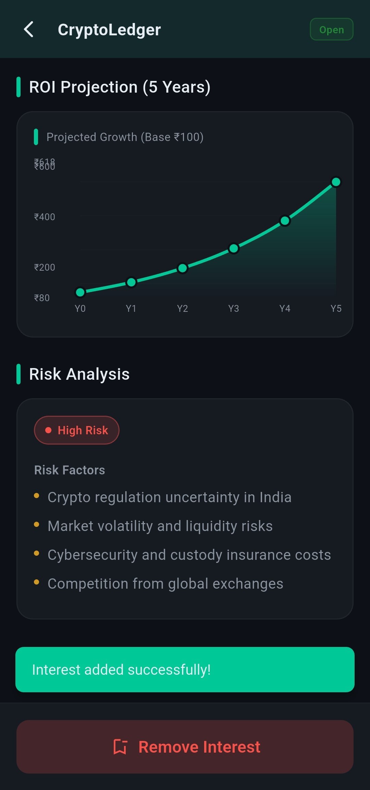
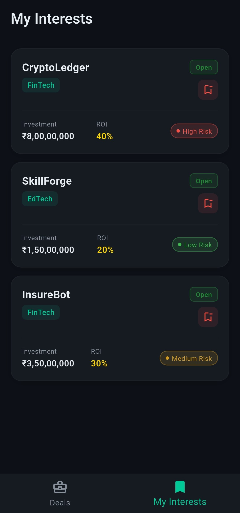

# DealFlow - Invester Deal Management App

[](https://github.com/AtharvaParadkar/Investor-Deal-Management-App/raw/main/apk/dealflow.apk)

A Flutter application for managing investment deals. Corporates post investment opportunities, and investors can browse, filter, express interest, and track deals.

## Features

### 🔐 Authentication
- Email/password login with mock credentials
- Session persistence using SharedPreferences
- Animated splash screen with session auto-restore

### 📊 Deal Management
- Browse 12+ investment deals across FinTech, CleanTech, HealthTech, EdTech, and AgriTech
- View detailed deal information including financials, ROI projections, and risk analysis
- Interactive ROI projection chart (5-year compound growth)
- Pull-to-refresh deal list

### 🔍 Advanced Filtering
- Real-time search with 300ms debounce
- ROI range slider (0-50%)
- Risk level toggle chips (Low/Medium/High)
- Industry selection chips
- Active filter chips with dismiss functionality

### ⭐ My Interests
- Express interest in deals from detail screen
- Track all interested deals in a dedicated tab
- Remove interests with animated transitions
- Persistent storage using SharedPreferences


## Screenshots

<table>
  <tr>
    <td align="center"><b>Splash Screen</b></td>
    <td align="center"><b>Login</b></td>
  </tr>
  <tr>
    <td></td>
    <td></td>
  </tr>
  <tr>
    <td align="center"><b>Deal List</b></td>
    <td align="center"><b>Search & Filter</b></td>
  </tr>
  <tr>
    <td></td>
    <td></td>
  </tr>
  <tr>
    <td align="center"><b>Filter Sheet</b></td>
    <td align="center"><b>Deal Detail</b></td>
  </tr>
  <tr>
    <td></td>
    <td></td>
  </tr>
  <tr>
    <td align="center"><b>ROI Chart</b></td>
    <td align="center"><b>Risk Analysis</b></td>b
  </tr>
  <tr>
    <td></td>
    <td></td>
  </tr>
  <tr>
    <td align="center"><b>I'm Interested</b></td>
    <td align="center"><b>My Interests</b></td>
  </tr>
  <tr>
    <td></td>
    <td></td>
  </tr>
</table>

## Architecture

**Feature-first clean architecture** with BLoC state management:

```
lib/
├── constants/          # Colors, typography, spacing, strings
├── utils/              # Validators, formatters, helpers, global widgets
├── login/              # Authentication feature (BLoC + Repository)
├── deals/              # Deal listing & detail (BLoC + FilterBLoC + Repository)
├── my_interest/        # Interest tracking (BLoC + Repository)
├── splash/             # Splash screen with session check
└── main.dart           # App entry, DI setup, routing
```

Each feature is self-contained with its own `bloc/`, `model/`, `repository/`, and `ui/` layers.

## Tech Stack

| Package | Purpose |
|---------|---------|
| `flutter_bloc` | State management |
| `fl_chart` | ROI projection charts |
| `google_fonts` | Inter typography |
| `shared_preferences` | Local persistence |

## Getting Started

### Prerequisites
- Flutter SDK (3.10+)
- Dart SDK (3.10+)

### Installation

```bash
# Clone the repository
git clone "https://github.com/AtharvaParadkar/Investor-Deal-Management-App.git"
cd invester_deal_management_app

# Install dependencies
flutter pub get

# Run the app
flutter run
```

### Demo Credentials

| Email | Password | Role |
|-------|----------|------|
| `investor@dealflow.com` | `password123` | Investor |
| `admin@dealflow.com` | `admin456` | Admin |

## Screens

1. **Splash Screen** — Animated logo with session check
2. **Login Screen** — Dark fintech themed login with form validation
3. **Deal List Screen** — Searchable, filterable deal cards with pull-to-refresh
4. **Deal Detail Screen** — Full financial info, ROI chart, risk analysis, interest toggle
5. **My Interests Screen** — Saved deals with remove functionality
6. **Filter Bottom Sheet** — ROI range, risk level, and industry filters

## Design System

- **Theme**: Dark fintech (navy/charcoal backgrounds)
- **Primary Color**: `#00C896` (vibrant green)
- **Typography**: Google Fonts Inter
- **Risk Colors**: Green (Low), Amber (Medium), Red (High)
- **Currency Format**: Indian numbering (₹50,00,000)

## License

This project is for demonstration purposes.
